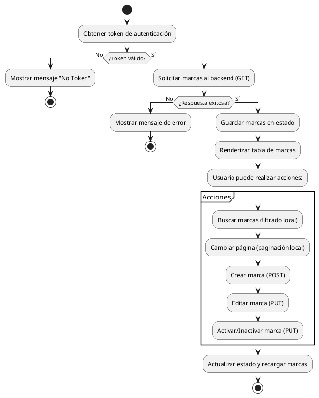

# Proceso de desarrollo del endpoint "brands" (marcas) - Backend y Frontend

---

## 1. Análisis y diseño

- **Requerimiento:** Gestionar marcas (brands) con operaciones CRUD (crear, leer, actualizar, eliminar), paginación y búsqueda.
- **Modelo de datos:** Definir entidad Brand con campos como id, code, name, description, active, createdAt, updatedAt, userId.

---

## 2. Backend: Implementación del endpoint

### 2.1. Definir el modelo Brand

```typescript
// Ejemplo en TypeORM/Mongoose/Sequelize
export interface Brand {
  id: string;
  code: string;
  name: string;
  description?: string;
  active: boolean;
  createdAt: Date;
  updatedAt: Date;
  userId?: string;
}
```

### 2.2. Crear el controlador y rutas

- **GET /brands**: Listar marcas con paginación (`skip`, `limit`).
- **POST /brands**: Crear nueva marca.
- **PUT /brands/:id**: Actualizar marca.
- **DELETE /brands/:id**: Eliminar marca.

```typescript
// Ejemplo Express
router.get('/brands', authMiddleware, brandsController.list);
router.post('/brands', authMiddleware, brandsController.create);
router.put('/brands/:id', authMiddleware, brandsController.update);
router.delete('/brands/:id', authMiddleware, brandsController.delete);
```

### 2.3. Lógica de paginación y búsqueda

- En el método `list`, recibir parámetros `skip`, `limit`, y opcionalmente `search`.
- Filtrar por nombre si se recibe `search`.
- Retornar `{ total, items }`.

### 2.4. Validaciones y seguridad

- Validar datos de entrada.
- Proteger rutas con autenticación (token).
- Manejar errores y retornar mensajes claros.

---

## 3. Frontend: Consumo del endpoint

### 3.1. Crear servicio de marcas

```typescript
// brandService.ts
export const brandService = {
  getBrands: (token, { skip, limit }) => { /* llamada fetch/axios */ },
  createBrand: (data, token) => { /* llamada POST */ },
  updateBrand: (id, data, token) => { /* llamada PUT */ },
  deleteBrand: (id, token) => { /* llamada DELETE */ }
};
```

### 3.2. Hook personalizado para gestión de marcas

- `useBrands` maneja estados, paginación, errores y CRUD.
- Llama a `brandService` y actualiza el estado local.

### 3.3. Componente de listado y acciones

- `BrandsPage` muestra la tabla, paginación, búsqueda y modales.
- Filtra marcas localmente por nombre.
- Aplica paginación sobre el resultado filtrado.
- Permite crear, editar y activar/inactivar marcas.

### 3.4. Manejo de errores y estados

- Muestra mensajes de error amigables.
- Indica estado de carga.
- Actualiza la vista tras cada acción.

---

## 4. Diagrama de flujo del proceso



---

## 5. Consideraciones clave

- **Hooks:** Nunca llamar hooks condicionalmente en React.
- **Token:** Todas las operaciones requieren autenticación.
- **Paginación:** Backend retorna paginado, frontend puede paginar y filtrar localmente.
- **Errores:** Mostrar mensajes claros y amigables.
- **Integración:** Probar con datos reales y validar todos los flujos.

---

## 6. Pruebas y validación

- Probar cada operación (listar, crear, editar, eliminar, activar/inactivar).
- Validar paginación y búsqueda.
- Verificar manejo de errores y estados de carga.

---

## 7. Mantenimiento y escalabilidad

- Documentar el código y los endpoints.
- Mantener consistencia en los nombres y estructuras.
- Preparar para futuras extensiones (filtros avanzados, exportación, etc.).

---

**Fin del documento**
