# Proceso de desarrollo del endpoint "brands" (marcas) - Backend y Frontend

---

## 1. Análisis y diseño

- **Requerimiento:** Gestionar marcas (brands) con operaciones CRUD, paginación y búsqueda.
- **Modelo de datos:** Definir entidad Brand con campos como id, code, name, description, active, createdAt, updatedAt, userId.

---

## 2. Backend: Implementación del endpoint

### 2.1. Definir el modelo Brand

```typescript
// ...backend/model/Brand.ts...
export interface Brand {
  id: string;
  code: string;
  name: string;
  description?: string;
  active: boolean;
  createdAt: Date;
  updatedAt: Date;
  userId?: string;
}
```

### 2.2. Crear el controlador y rutas

```typescript
// ...backend/routes/brands.ts...
router.get("/brands", authMiddleware, brandsController.list);
router.post("/brands", authMiddleware, brandsController.create);
router.put("/brands/:id", authMiddleware, brandsController.update);
router.delete("/brands/:id", authMiddleware, brandsController.delete);
```

### 2.3. Lógica de paginación y búsqueda

```typescript
// ...backend/controllers/brandsController.ts...
async function list(req, res) {
  const { skip = 0, limit = 10, search = "" } = req.query;
  // Filtra por nombre si search está presente
  const query = search ? { name: { $regex: search, $options: "i" } } : {};
  const total = await Brand.countDocuments(query);
  const items = await Brand.find(query).skip(Number(skip)).limit(Number(limit));
  res.json({ total, items });
}
```

### 2.4. Validaciones y seguridad

- Validar datos de entrada en cada endpoint.
- Proteger rutas con autenticación (token).
- Manejar errores y retornar mensajes claros.

---

## 3. Frontend: Consumo del endpoint

### 3.1. Servicio de marcas

```typescript
// ...frontend/app/services/brandService.ts...
export const brandService = {
  getBrands: (token, { skip, limit }) => {
    // ...existing code...
    // fetch(`/api/brands?skip=${skip}&limit=${limit}`, { headers: { Authorization: `Bearer ${token}` } })
  },
  createBrand: (data, token) => {
    // ...existing code...
  },
  updateBrand: (id, data, token) => {
    // ...existing code...
  },
  deleteBrand: (id, token) => {
    // ...existing code...
  },
};
```

### 3.2. Hook personalizado para gestión de marcas

```typescript
// filepath: e:\Desarrollo\IA\Projects\4_Ventas\frontend\hooks\useBrands.ts
// ...existing code...
export function useBrands(token: string | null) {
  // Estados para almacenar marcas, carga, errores, paginación y total
  // ...existing code...
  // Función para obtener marcas desde el backend, considerando paginación
  const fetchBrands = useCallback(async () => {
    // ...existing code...
    const skip = (page - 1) * pageSize;
    const response = await brandService.getBrands(token, {
      skip,
      limit: pageSize,
    });
    // ...existing code...
  }, [token, page, pageSize]);
  // ...existing code...
}
```

### 3.3. Componente de listado y acciones

```tsx
// filepath: e:\Desarrollo\IA\Projects\4_Ventas\frontend\app\brands\page.tsx
// ...existing code...
export default function BrandsPage() {
  // ...existing code...
  // Filtra marcas por nombre según el texto de búsqueda
  const filteredBrands = search
    ? brands.filter((cat: any) =>
        cat.name?.toLowerCase().includes(search.toLowerCase())
      )
    : brands;

  // Aplica paginación sobre el resultado filtrado
  const paginatedBrands = filteredBrands.slice((page - 1) * pageSize, page * pageSize);
  // ...existing code...
  return (
    <div className="p-6">
      {/* Muestra errores si existen */}
      {error && (
        // ...existing code...
      )}
      <div className="bg-white shadow rounded p-4 space-y-6">
        {/* Encabezado y acciones */}
        <div className="flex items-center justify-between">
          <h3 className="font-semibold">Lista de Marcas ({filteredTotal}/{total})</h3>
          {/* ...existing code... */}
        </div>
        {/* Caja de búsqueda */}
        <div className="mb-4">
          <input
            type="text"
            placeholder="Buscar marca..."
            value={search}
            onChange={e => {
              setSearch(e.target.value);
              setPage(1); // Reinicia a la primera página al buscar
            }}
            className="border px-3 py-2 rounded w-full"
          />
        </div>
        {/* Tabla de marcas filtradas y paginadas */}
        <BrandTable
          brands={paginatedBrands}
          loading={loading}
          onEdit={(b) => { setEditing(b); }}
          onToggleActive={(id, val) => {
            setPendingToggle({ id, value: val });
            setConfirmOpen(true);
          }}
        />
        {/* ...existing code... */}
      </div>
      {/* ...existing code... */}
    </div>
  );
}
```

### 3.4. Tabla de marcas

```tsx
// filepath: e:\Desarrollo\IA\Projects\4_Ventas\frontend\components\BrandTable.tsx
// ...existing code...
export const BrandTable: React.FC<BrandTableProps> = ({
  brands,
  onEdit,
  onToggleActive,
  loading = false,
}) => {
  // ...existing code...
  return (
    <div className="overflow-x-auto rounded-lg shadow">
      <table className="min-w-full table-auto border border-gray-200">
        {/* ...existing code... */}
        <tbody className="bg-white divide-y divide-gray-200">
          {brands.length === 0 ? (
            <tr>
              <td
                colSpan={4}
                className="text-center py-8 text-gray-500 text-lg"
              >
                <span role="img" aria-label="Caja vacía">
                  
                </span>{" "}
                No existen marcas disponibles
              </td>
            </tr>
          ) : (
            brands.map((brand) => (
              <tr key={brand.id} className="hover:bg-gray-50 transition-colors">
                <td
                  className="px-3 py-2 text-sm font-mono text-gray-900 w-32 truncate leading-tight"
                  title={brand.code}
                >
                  {brand.code}
                </td>
                <td
                  className="px-3 py-2 text-sm font-medium text-gray-900 w-48 truncate leading-tight"
                  title={brand.name}
                >
                  {brand.name}
                </td>
                <td className="px-2 py-2 text-sm text-center">
                  <BotonEstado
                    active={!!brand.active}
                    onClick={() =>
                      onToggleActive && onToggleActive(brand.id, !brand.active)
                    }
                    titleWhenActive="Desactivar marca"
                    titleWhenInactive="Activar marca"
                  />
                </td>
                <td className="px-2 py-2 text-sm font-medium flex flex-wrap gap-1 justify-center">
                  <BotonAccion
                    type="button"
                    onClick={() => setDetailBrand(brand)}
                    aria-label="Ver marca"
                    title="Ver marca"
                    className="text-indigo-600 hover:text-indigo-700"
                  >
                    <Eye className="h-4 w-4" />
                  </BotonAccion>
                  {onEdit && (
                    <BotonAccion
                      type="button"
                      onClick={() => onEdit(brand)}
                      aria-label="Editar marca"
                      title="Editar marca"
                      className="text-blue-600 hover:text-blue-700"
                    >
                      <Pencil className="h-4 w-4" />
                    </BotonAccion>
                  )}
                </td>
              </tr>
            ))
          )}
        </tbody>
      </table>
      <BrandDetailModal
        brand={detailBrand}
        onClose={() => setDetailBrand(null)}
      />
    </div>
  );
};
```

---

## 4. Diagrama de flujo del proceso

```puml
@startuml
start
:Obtener token de autenticación;
if (¿Token válido?) then (No)
  :Mostrar mensaje "No Token";
  stop
else (Sí)
  :Solicitar marcas al backend (GET);
  if (¿Respuesta exitosa?) then (No)
    :Mostrar mensaje de error;
    stop
  else (Sí)
    :Guardar marcas en estado;
    :Renderizar tabla de marcas;
    :Usuario puede realizar acciones:;
    partition Acciones {
      :Buscar marcas (filtrado local);
      :Cambiar página (paginación local);
      :Crear marca (POST);
      :Editar marca (PUT);
      :Activar/Inactivar marca (PUT);
    }
    :Actualizar estado y recargar marcas;
    stop
  endif
endif
@enduml
```



---

## 5. Consideraciones clave

- **Hooks:** Nunca llamar hooks condicionalmente en React.
- **Token:** Todas las operaciones requieren autenticación.
- **Paginación:** Backend retorna paginado, frontend puede paginar y filtrar localmente.
- **Errores:** Mostrar mensajes claros y amigables.
- **Integración:** Probar con datos reales y validar todos los flujos.

---

## 6. Pruebas y validación

- Probar cada operación (listar, crear, editar, eliminar, activar/inactivar).
- Validar paginación y búsqueda.
- Verificar manejo de errores y estados de carga.

---

## 7. Mantenimiento y escalabilidad

- Documentar el código y los endpoints.
- Mantener consistencia en los nombres y estructuras.
- Preparar para futuras extensiones (filtros avanzados, exportación, etc.).

---

**Fin del documento**
